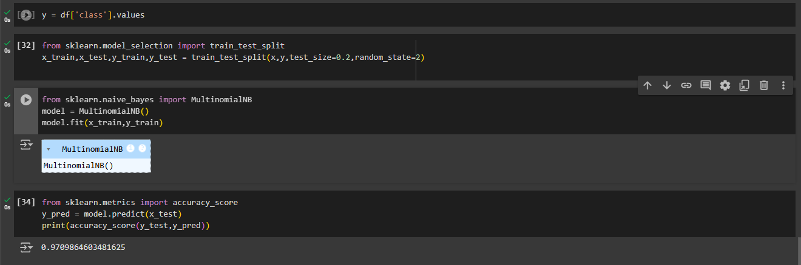

# Spam-Classification-using-NLP
"Spam Classification using NLP" builds SMS spam classifier using text preprocessing, TF-IDF vectorization, and a Naive Bayes model. It processes SMS data by cleaning, tokenizing, and stemming words, then trains the classifier to detect spam. Stages include data loading, preprocessing, training, evaluation to assess accuracy and model performance.

This project focuses on building a simple spam classifier using Natural Language Processing (NLP) and Machine Learning techniques. The classifier is trained to distinguish between spam and non-spam (ham) SMS messages. 

## Project Overview
Spam detection is an important application in NLP, helping to filter unwanted messages. This project utilizes the Naive Bayes algorithm for classification, a popular choice for text classification problems.

## Table of Contents
- [Installation](#installation)
- [Dataset](#dataset)
- [Data Preprocessing](#data-preprocessing)
- [Model Training](#model-training)
- [Evaluation](#evaluation)
- [Results](#results)
- [Contributing](#contributing)
- [License](#license)

## Installation
To run this project locally, ensure you have the following dependencies installed:
- Python 3.x
- NLTK
- Pandas

# Spam Classification using NLP

This project builds a simple spam classifier using NLP and machine learning techniques, focused on identifying spam vs. ham (non-spam) messages. It preprocesses text data, converts it into numerical features, and trains a Naive Bayes classifier to distinguish between spam and non-spam messages.

## Dataset
The dataset used is a collection of SMS messages labeled as spam or ham. The dataset should be saved in Google Drive for access within Google Colab.

## Data Preprocessing
The preprocessing steps include:
1. **Data Loading**: Load the dataset from Google Drive.
2. **Cleaning the Data**: Drop unnecessary columns and rename relevant columns for readability.
3. **Removing Duplicates**: Ensure each message is unique.
4. **Tokenization and Text Cleaning**:
   - Convert text to lowercase.
   - Tokenize words and remove non-alphanumeric characters.
   - Remove stopwords (e.g., "the", "and").
   - Apply stemming using Porter Stemmer to reduce words to their root forms.

## Model Training
1. **Text Vectorization**: Use TF-IDF (Term Frequency-Inverse Document Frequency) vectorizer to convert messages into numerical format.
2. **Splitting the Data**: Divide data into training and test sets.
3. **Training the Model**: Train a Multinomial Naive Bayes classifier for text classification.

## Evaluation
The model is evaluated on the test set using accuracy to measure its performance.

## Results
The classifier outputs an accuracy score that indicates its ability to distinguish between spam and non-spam messages.

- **Accuracy Score**: Display the model's accuracy here.
  

## Usage
To use this project:
1. Clone the repository.
2. Place the dataset in the appropriate folder.
3. Run the notebook on Google Colab or a similar environment with access to Google Drive.

# Spam Classification using NLP

## Code Example

```python
# Load dataset
df = pd.read_csv('/content/drive/MyDrive/Colab Notebooks/Spam Classification using NLP Data Set.csv', encoding='latin-1')

# Preprocess and clean data
df['sms_cleaned'] = df['sms'].apply(clean_text)

# Train model
model.fit(x_train, y_train)


## License

# Spam Classification using NLP

**Project Description**

**Project Name**: Spam Classification using NLP

**Description**: This project demonstrates a spam classifier for SMS messages using Python libraries such as NLTK and Scikit-Learn. We preprocess text data, clean and stem it, convert it into numerical features with TF-IDF vectorization, and classify it using a Naive Bayes model.

---

**Code Walkthrough**

1. **Import Libraries**: Load libraries for data manipulation (`pandas`), natural language processing (`nltk`), and model building (`sklearn`).

2. **Load Dataset**: The dataset is loaded from Google Drive for easy access in Google Colab.
    ```python
    # Load dataset
    df = pd.read_csv('/content/drive/MyDrive/Colab Notebooks/Spam Classification using NLP Data Set.csv', encoding='latin-1')
    ```

3. **Data Preprocessing**:
   - **Column Cleanup**: Drop unnecessary columns.
   - **Rename Columns**: Rename columns for easier reference.
   - **Remove Duplicates**: Keep only unique entries.
   - **Feature Engineering**: Add a `length` feature that counts the length of each message.

4. **Text Cleaning**:
   - Convert text to lowercase.
   - Tokenize text.
   - Remove stopwords and punctuation.
   - Stem words using Porter Stemmer.
    ```python
    # Preprocess and clean data
    df['sms_cleaned'] = df['sms'].apply(clean_text)
    ```

5. **Vectorization**: Transform cleaned text data into numerical form using `TfidfVectorizer`.

6. **Model Training**:
   - Split data into training and test sets.
   - Train a Multinomial Naive Bayes model on the training set.
    ```python
    # Train model
    model.fit(x_train, y_train)
    ```

7. **Evaluation**: Make predictions on the test set and calculate accuracy.

---

**Contributing**

Contributions are welcome! Please feel free to submit a Pull Request.

**License**

This project is licensed under the MIT License.

